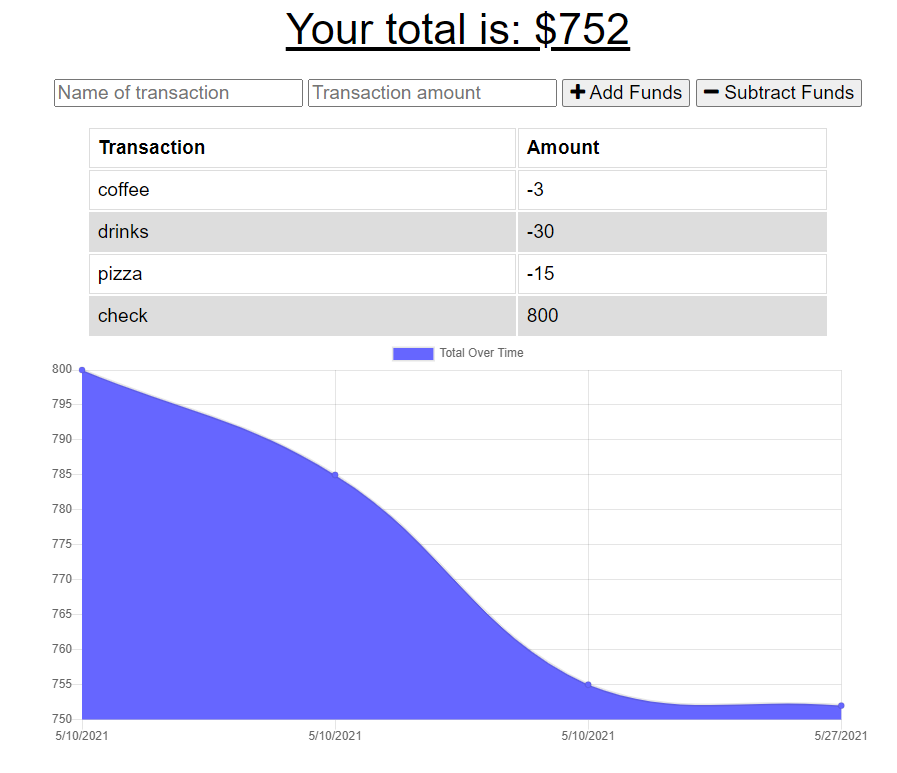

 

# 
 **Budget Tracker** 

--- 

--- 

## **Table Of Contents** 

---

1. [Description](#description)
2. [Installation](#installation)
3. [Usage](#usage)
4. [Tests](#tests)
5. [Review and Contribute](#github)
--- 

## 
  **Description** 
 

--- 

A simple app that uses web manifest technology to store and cache data offline, so you can use the application without worry that your data isn't going to be recorded.

--- 
 
## 
  **Installation** 

--- 
 
You can download the repo locally via the link to the repository listed below.After you clone the repo, run an '$ npm i' in your bash terminal to download the necessary dependencies.  To run the app input npm start.  The app should direct you to port 3000 or the personally set port.

--- 

## 
  **Usage** 

--- 

To use the interface, click on the plus or minus button to add or subtract funds from your buget. You'll put in your transaction, and the amount which will show the steps on the graph.  To test its availability offline simply throttle it in the dev tools on Google Chrome.

--- 

## 
 **Review and contribute here**

### _Github:_ [calvinJacobsen/budget-tracker](https://github.com/CalvinJacobsen/Budgeteer)

### _Email:_ Jaco1932@umn.edu

### _Heroku:_ [Budget Tracker](https://bugeteer.herokuapp.com/)

--- 